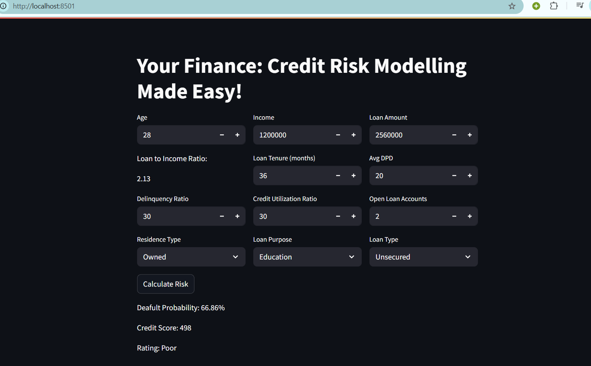

YOUR FINANCE- A CREDIT RISK MODELLING PROJECT

This project is a machine learning-based web application that predicts the risk associated with a credit applicant. It uses user-input financial and behavioral parameters to assess the default probability, calculate a credit score, and assign a rating.

## 📈 Key Features

- 🔍 Predicts default risk using a Logistic Regression model
- 📊 Displays credit score on a scale from 300 to 900
- 🧠 Provides user-friendly risk ratings: Poor, Average, Good, Excellent
- ⚙️ Built with:
  - Python, Streamlit (Frontend)
  - Scikit-learn, Joblib (Model backend)
  - Logistic Regression for classification
- 💾 Model and Scaler loaded using `joblib` from pre-trained artifacts

## 🧮 Inputs Collected

- Age, Income, Loan Amount
- Loan Tenure, Delinquency Ratio, DPD
- Credit Utilization, Number of Open Accounts
- Loan Purpose, Type, and Residence Status

## 📸 Screenshot

---

## 🛠️ How It Works

